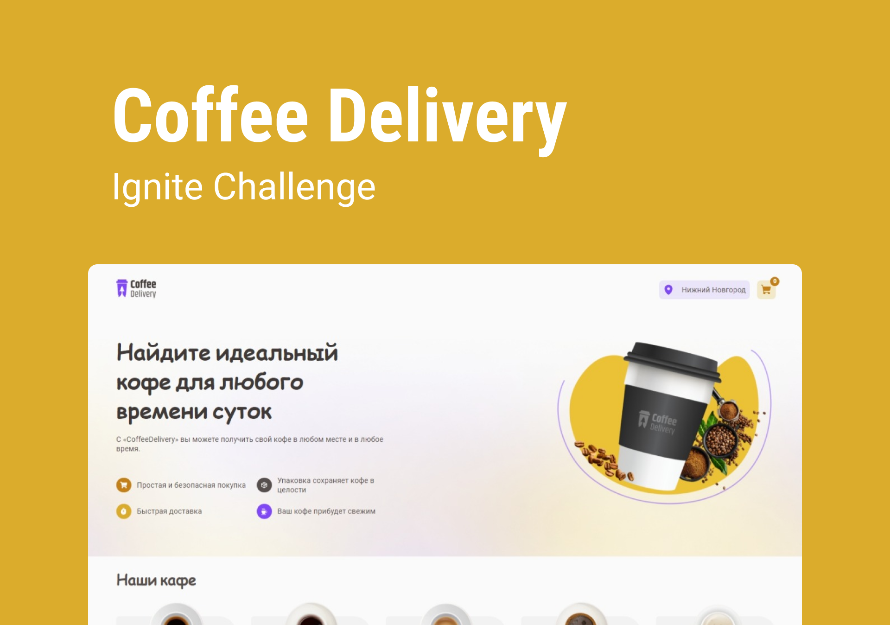

<h1 align="center">
  
</h1>

<h1 align="center">Rocketseat Challenge</h1>
<h2 align="center">Ignite ReactJS</h2>

  

# 🚀 Techs

> - [React JS](https://reactjs.org/)
> - [TypeScript](https://www.typescriptlang.org/)
> - [Styled Component](https://styled-components.com/)
> - [Hooks](https://legacy.reactjs.org/docs/hooks-intro.html)
> - [Context API](https://legacy.reactjs.org/docs/context.html#reactcreatecontext)
> - [Zod](https://zod.dev/)
> - [AOS Animation On Scroll](https://michalsnik.github.io/aos/)

# 💻 Project

To practice the ReactJS basic concepts.

# Running the Project
## `Make sure you are in the "main" branch`
## Or you may check the project done with JSON Server, [here](https://github.com/inacio000/coffee-deliver/tree/feture-fake-api-with-json-server)
- Clone repository
  > git clone https://github.com/inacio000/coffee-deliver.git
- Install dependencies
  > npm install
- Run frontend
  > npm start
